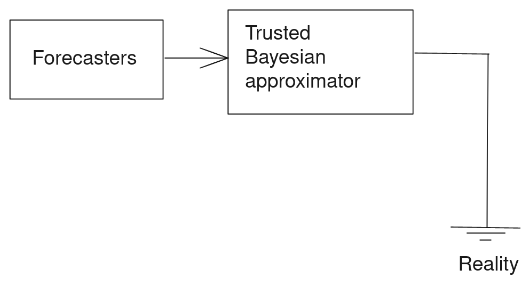
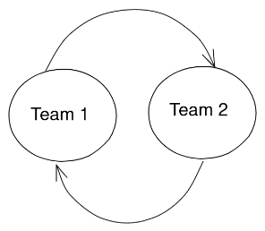

# Motivation

In [Alignment Problems With Current Forecasting Platforms](https://arxiv.org/abs/2106.11248), Sempere and Lawsen outline a variety of problems with current forecasting platforms, whose scoring rules are found to either not be proper—as in the case of Good Judgment Open or CSET-Foretell (now INFER)—or incentivize distorting one's true probabilities to maximize the chances of placing in the top few positions which earn a monetary reward—as in the case of Metaculus. In addition, in almost all cases, forecasting platforms—or, for that matter, prediction markets—disincentivize collaboration.

Against that backdrop, [Reciprocal Scoring: A Method for Forecasting Unanswerable Questions](https://papers.ssrn.com/sol3/papers.cfm?abstract_id=3954498), Karger et al. describe a method to ellicit predictions in situations in which resolutions are outright not possible, or very far away. They provide some preliminary evidence of its effectiveness in the form of a small randomized trial. However, in the post-peer-review discussion phase in social media, Karger et al.'s method was met with an extremely lukewarm reception from the community of forecasting practitioners, which has grown to view methods which resemble Keynesian Beauty Constests with suspicion.

In this working paper, we outline an alternative incentivization method, "amplify Samotsvety"[^1], which roughly looks as follows:

- There is a trusted central authority which cares about its long-term reputation. This central authority is trusted, but has limited capacity. 
- Forecasters are then rewarded according to a scheme where they forecast on all questions, the central authority predicts on only a few questions chosen randomly, and then forecasters are rewarded according to the proximity of their predictions to that central authority. 

This scheme has the advantage that forecasters can be rewarded speedily for questions which either have no objective resolution or happen far in the future. In addition, if the trusted authority has long horizons, it can be rewarded when the question resolves in the future, or according to the best guess of a future forecasting system.

[^1]: Samotsvety is Russian for "semi-precious stones". It is also the name of a forecasting team in which the authors are involved. 

# Description of the method

In the interest of brevity, we shall outline our method by means of an example, and the example shall be the question "Will the People's Republic of China have annexed at least half of Taiwan by 2050?", as operationalized by [Metaculus](https://www.metaculus.com/questions/5320/chinese-annexation-of-most-of-taiwan-by-2050/). Alas, this method requires a cluster or questions, so the reader should picture a cluster of questions similar to that one.

## Samotsvety determines a rough prior of all questios, in order to reduce potential reward.

Taiwan has been independent of mainland China since the 25th of October 1945, i.e., 76 years into the past. Per Laplace's law, the chances that this will change by 2050 is $1-(1-\frac{1}{(2021-1945)+1})^{2050-2021} \approx 32\%$. Lets take this $32\%$ as 's initial probability. Note that per the [reference class problem](https://en.wikipedia.org/wiki/Reference_class_problem), other reference classes might have been chosen, so the point of this prior is not to be definitive, but rather to provide a starting point less arbitrary than 50\% from which forecaster reward might be computed in the next steps. In the case of a patron aiming to learn from sponsoring a forecasting tournament, the prior might represent the patron's initial probability.

## Forecasters attempt to foresee Samotsvety's future forecast.

Forecasters spend some effort trying to come up with forecasts which beat the prior. If they are rewarded in proportion to how much they beat this prior, as outlined in [Paying for bits](), they have an incentive to collaborate.

## Samotsvety predicts on a randomly chosen number of questions

Samotsvety chooses some questions at random, and produces a forecast for these questions. 

## Forecasters are rewarded or punished ccording to how much their probability moves from the prior to Samotsvety's forecast.

As outlined in [Paying for bits](), forecasters end up with a positive balance, if they have moved the probability from the prior towards Samotsvety's forecast. But if they moved the probability in the opposite direction, they end up with a negative balance.

In this case, forecasters should be rewarded in proportion to the number of questions which resolve. For instance, if Samotsvety only looks at one in ten questions, reward or punishment is multiplied by 10.

Within the prediction market conceptualization, the maximum price of a share would be $10 rather than $1. But since shares only have a 10% chance of paying out, their price doesn't exceed $1.

## Optionally, after a time, reality is observed, and Samotsvety itself is paid or punished in proportion to their accuracy.

This requires Samotsvety to have large time horizons.

# Discussion of the method

## More on the central authority

Implicitly, we have been presenting this central authority as more trustworthy, or more truth-seeking than the other forecasters which are used to amplify it. But this might not necessarily be the case at all: this method might be used as a cost-saving device instead. For instance, maybe some forecasters are more willing to receive rewards later rather than immediately, but both sets of forecasters produce similar quality forecasts. Alternatively, perhaps all forecasters have similar discount rates, but rewarding many forecasters for predictions which will be resolved long into the future might be too expensive. In that case, tournament designers might arbitrarily divide a tournament's cohort into forecasters rewarded now and authorities which are rewarded later, with the former attempting to predict and give information to the latter.

Note that this amplification method might go very wrong if forecasting something such as "Will the US dollar suffer from large amounts of inflation?". In that case, forecasters' who have reason to believe in inflation might self-select into the group which gets rewarded now (in dollars), and likewise forecasters with beliefs about lack of inflation might self-select into the group which gets rewards later. In that case, the first group of short-termists might sneakily predict that the second group will think that there will be no inflation, but the link between the forecasting system and reality would have been weakened.

## More on the forecasters

## Evidence base and comparison to Karger et al.'s method

On the one hand, most of the reasons why I think why this method might be superior come from first principles reasoning or from my experience with forecasting. With regards to first-principle reasoning, reasoning analogous to that of [how to buy truth from a liar](https://meteuphoric.com/2014/07/21/how-to-buy-a-truth-from-a-liar/) implies that this method will eventually converge at the truth. To elaborate, the way for researchers to extract maximum reward from the Bayesian approximator is by feeling it as much evidence as they can. Further, it just feels more elegant. 

With regards to evidence from my experience as a forecaster, it just feels more grounded. Forecasters try to predict or amplify a trusted Bayesian approximator, and the trusted Bayesian approximator tries to predict reality. If a forecaster has unique information, they can and should try to convince the Bayesian approximator. If the evidence is just very private or hard to communicate, the forecaster with that information could offer a bet to the Bayesian approximator. Forecasters are incentivized to conduct expensive searches (e.g., interviews with citizens of far-away lands), cf. [Linch Zhang](https://twitter.com/LinchZhang/status/1455759586158268417).

{ width=50% }

In contrast, Karger's method has weird loops; teams are not aiming to forecast reality, but rather to forecast what the other team will forecast that one's team will forecast that the other team will forecast... In the presence of Schelling points, human biases, laziness, etc., it is not clear that this process converges to the truth. For instance, the forecaster which puts in the most research effort, or the group which puts in the most effort, is disadvantaged: ideally, both groups want to put in the same amount of effort, or, equivalently, find out the same things. 

Some of the authors in Karger et al.'s paper bring forward the argument that if one has larger enough teams, each person should expect and equivalent someone in the other team to find the same evidence. Although perhaps true in the limit, this in my experience does not seem likely to be true in any degree of practice.

{ width=30% }

Although both Karger et al.'s and our method output a legible output, in Karger's case this is a wiki, and in our case this is an approximate Bayesian calculation. We believe that a Bayesian calculation probably is the most legible of the two outputs. In particular, one can tweak only some of the inputs and see how the outputs change, which would be more difficult to do in a wiki.

## Conclusion

In conclusion, the proposed method of amplifying an expensive but Bayesian approximator has the benefit of appearing more grounded, and not having the weird loops in Karger et al.'s reciprocal scoring proposal—or in other Keynesian beauty contest designs. Further, the existence of Rootclaim provides proof of existence of sch trusted Bayesians approximators. We look forward to someone implementing the method.

***

