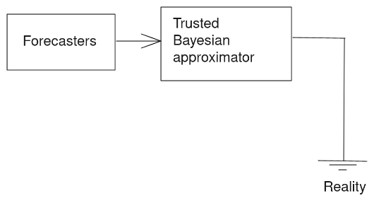

# Motivation

In [Alignment Problems With Current Forecasting Platforms](https://arxiv.org/abs/2106.11248), Sempere and Lawsen outline a variety of problems with current forecasting platforms, whose scoring rules are found to either not be proper—as in the case of Good Judgment Open or CSET-Foretell (now INFER)—or incentivize distorting one's true probabilities to maximize the chances of placing in the top few positions which earn a monetary reward—as in the case of Metaculus. In addition, in almost all cases, forecasting platforms—or, for that matter, prediction markets—disincentivize collaboration.

Against that backdrop, [Reciprocal Scoring: A Method for Forecasting Unanswerable Questions](https://papers.ssrn.com/sol3/papers.cfm?abstract_id=3954498), Karger et al. describe a method to elicit predictions in situations in which resolutions are outright not possible, or very far away. They provide some preliminary evidence of its effectiveness in the form of a small randomized trial. However, in the post-peer-review discussion phase in social media, Karger et al.'s method was met with a lukewarm reception from the community of forecasting practitioners, which has grown to view methods which resemble Keynesian Beauty Constests with suspicion.

In this working paper, we outline an alternative method, "amplify a Bayesian", which briefly looks as follows:  

- There is a trusted authority capable of approximate Bayesian updates which cares about its long-term reputation, but which has limited capacity   
- A larger contingent of forecasters submit bids to that central authority, and is rewarded when their bids cause the central authority to update.

One example of a central authority able to produce Bayesian updates might be [Rootclaim](https://www.rootclaim.com/). Rootclaim produces a small number of highly detailed Bayesian analysis of current affairs, and has a strong interest in mantaining its reputation in the long-term—on the one hand because its business model is precisely based on mantaining an accurate long-term public track record, and on the other hand to prove the superiority of Bayesian methods, as every Bayesian deeply desires in her heart to do. However, Rootclaim's track record isn't yet clear.

# Description of the method

In the interest of brevity, we shall outline our method by means of an example, and the example shall be the question "Will the People's Republic of China have annexed at least half of Taiwan by 2050?", as operationalized by [Metaculus](https://www.metaculus.com/questions/5320/chinese-annexation-of-most-of-taiwan-by-2050/). 

## A trusted authority determines a rough prior to reduce potential forecasting reward
Taiwan has been independent of mainland China since the 25th of October 1945, i.e., 76 years into the past. Per Laplace's law, the chances that this will change by 2050 is $1-(1-\frac{1}{(2021-1945)+1})^{2050-2021} \approx 32\%$. Lets take this $32\%$ as our Bayesian's initial probability. Note that per the [reference class problem](https://en.wikipedia.org/wiki/Reference_class_problem), other reference classes might have been chosen, so the point of this prior is not to be definitive, but rather to provide a starting point less arbitrary than 50\% from which forecaster reward might be computed in the next steps. In the case of a patron aiming to learn from sponsoring a forecasting tournament, the prior might represent the patron's initial probability.

## Forecasters attempt to move the trusted authority's prior

Note that forecasters may also work in teams to submit arguments.

**By arguing that the prior is wrong**

Forecasters might output an argument like the following:

> The $32\%$ prior is computed with respect to Taiwan, but we have more information than that by looking at how China has asserted control over other outer territoritories or autonomous regions. Among these one might count Hong Kong, Macau and Tibet (and perhaps the Xinjiang Uygur Autonomous Region). Although the process of asserting control is more continuous in time, if we assume for simplification purposes that it happens in any one year, this moves our Laplace prior that another external territory will be brought under control at $1-(1-\frac{4}{(2021-1945)+1})^{2050-2021} \approx 78\%$. Because Taiwan is the only such territory left, this should be our probability for the question.

**By providing evidence about current affairs**

Forecasters might output an observation like the following:

> China's current bellicosity is different from the historical norm. For instance, China has been [sending record number of planes over Taiwan's air defence zone](https://www.bbc.co.uk/news/world-asia-58794094). This should increase the probability of a successful resolution.

## The trusted authority updates, and forecasters are rewarded

After receiving the updates such as above, the trusted authority makes an approximately Bayesian update. For instance, maybe she averages the two possible base rates, and moves from $32\%$ to $(32\% + 78\%)/2 = 55\%$. Then, it moves $5\%$ from $55\%$ to $60\%$ on account of the increased frequency of flights over Taiwanese airspace.

Now, one way forecasters could be rewarded would be in proportion to the percentage points of the update. However, this has the problem of rewarding an update from $1\%$ to $2\%$ the same as an update from $50\%$ to $51\%$, which seems undesirable. 

One parsimonious way to solve this is by denominating updates in terms of bits—which are the natural unit for strength of conviction, though we will not justify this here because acquiring intuitions for why this is the case can prove to be difficult. 

For intuition, an update from $2^{n}:1$ odds to $2^{m}:1$ odds is an update of $(m-n)$ bits, whose size is of $|m-n|$ bits, where $|\cdot|$ represents out the absolute value. So for example, an update from $2^1:1$ odds $\left(\frac{2^1}{2^1 + 1} = 66\%\right)$ to $2^3:1$ $\left(\frac{2^3}{2^3 + 1} = 88\%\right)$ odds corresponds to an update from 1 bit to 3 bits, i.e., an update size of 2 bits. Conversely, an update from $1:2$ $\left(1:2 \text{ is equivalent to } 2^{-1}:1, \text{ so } \frac{2^{-1}}{2^{-1} + 1} = 33\%\right)$ to $2^{2}:1$ $\left(\frac{2^2}{2^2 + 1} = 80\%\right)$ corresponds to an update from -1 bit to 2 bits, i.e. an update of 3 bits. 

Continuing to our example, the original probability of $32\%$ corresponds to around $1:2^1$ odds, or $2^{-1}:1$ odds, or strength of conviction of around -1 bit. The posterior probability of $55\%$ corresponds to around $1.22 : 1$ odds, or around $2^{0.3} : 1$ odds, or +0.3 bits. The difference between these is (0.3-(-1)) = 1.3 bits. An update from $55\%$ to $60\%$ would likewise be an update from $2^{0.3}:1$ to $2^{0.6}:1$, or 0.3 bits.

If we valued each bit of information about an invasion of Taiwan at $1000, the first forecaster would receive \$1,290, while the second would receive \$300.

Note that under this method, if the trusted authority then moved back to $55\%$ because of a third argument brought in by a third person, that third person would receive $300, but rewards already given out would not be taken back. 

# Discussion of the method

## More on the central authority

When implementing this method, one might actually hire the real-life Rootclaim. Alternatively, one might consider more than one central authority, and aggregate forecaster rewards using some weighted average. In practice, one or a group of excellent forecasters might also serve as such a central authority capable of forecasting. A central authority must be trusted, truth-seeking and unbiased for this method to work well; in practice it may be difficult to find authoriities that are trusted by all or most forecasters.

Throughout, we have also been using the phrase "approximately Bayesian". But some updates, such as realizing that one's *prior* is wrong or incorrect, are only clumsily modelled as Bayesian. Alternatively, updates from "thinking more about it", or "making a calibration adjustment" do not neatly fit into the Bayesian paradigm either. Further, updates for surprising events which not predicted with any probability by (e.g., imagine making a Bayesian update on the advent of nuclear weapons as a Japanese who wasn't keeping up with the physics of the 20th century) cannot, strictly speaking, be Bayesian. Nevertheless, we might still update a more generalized set of updates, which includes the aforementioned but not other, arbitrary updates. On this topic, see [Radical Probabilism](https://www.lesswrong.com/posts/xJyY5QkQvNJpZLJRo/radical-probabilism-1) and [Reflective Bayesianism](https://www.lesswrong.com/posts/vpvLqinp4FoigqvKy/reflective-bayesianism).

Implicitly, we have been presenting this central authority as more trustworthy, or more truth-seeking than the other forecasters which are used to amplify it. But this might not necessarily be the case at all: this method might be used as a cost-saving device instead. For instance, maybe some forecasters are more willing to receive rewards later rather than immediately, but both sets of forecasters produce similar quality forecasts. Alternatively, perhaps all forecasters have similar discount rates, but rewarding many forecasters for predictions which will be resolved long into the future might be too expensive. In that case, tournament designers might arbitrarily divide a tournament's cohort into forecasters rewarded now and authorities which are rewarded later, with the former attempting to predict and give information to the latter.

Note that this amplification method might go very wrong if forecasting something such as "Will the US dollar suffer from large amounts of inflation?". In that case, forecasters' who have reason to believe in inflation might self-select into the group which gets rewarded now (in dollars), and likewise forecasters with beliefs about lack of inflation might self-select into the group which gets rewards later. In that case, the first group of short-termists might sneakily predict that the second group will think that there will be no inflation, but the link between the forecasting system and reality would have been weakened.

## Incentive issues for forecasters

One more problem which might arise from the system of incentives which we have just described might be that forecasters simply spam the trusted authority with a large number of claims and sources, and wait for the trusted authority to filter them. This could be fixed by requiring inputs to be well-formed and well-written, or that we might not accept inputs which move the trusted authority by too small an amount, i.e., by rejecting inputs which are too "lazy". One could also make forecasters pay a small price for suggesting inputs, or only give forecasters a chance to give a finite number of inputs, which would also incentivize well-formed and well-structured inputs.

Another problem that might arise is that forecasters will be incentivized to exaggerate the weight of the evidence they are presenting, to get more reward from the central authority.

But there is another potential twist which might alleviate both of these problems, in addition to leading to further efficiency gains: Have forecasters also try to predict how much the trusted authority will be moved by every argument they bring\footnote{Note that this would require fixing the ordering of each new argument/piece of evidence}, and be rewarded for being accurate in that assessment in addition to being rewarded for bringing in new evidence. This may also incentivize forecasters to bring up any counter-evidence to exaggreated claims, and forecasters who consistently overexaggerate their claims could be penalized.

For instance, one forecaster might bring up the piece of evidence we mentioned above:

> > China's current bellicosity is different from the historical norm. For instance, China has been [sending record number of planes over Taiwan's air defence zone](https://www.bbc.co.uk/news/world-asia-58794094). This should increase the probability of a successful resolution.

And another forecaster might receive a small reward for accuracy in predicting how much the trusted authority would update after viewing that piece of evidence.

At this point, we have a methodology for bringing in new pieces of evidence and judging how much to update on them by, but it requires the trusted authority to look at each of them. However, the trusted authority—our expensive but trustworthy Bayesian approximator—could look at only a fraction of them, say 10\%, chosen randomly, but increase the rewards for those predictions tenfold. Depending on the setup, this might preserve incentive compatibility but allow us to trade off the trusted authority's more expensive procedure for the less expensive procedure of using forecasters. For more on this method, see [Amplifying generalist research via forecasting](https://www.lesswrong.com/posts/cLtdcxu9E4noRSons/part-1-amplifying-generalist-research-via-forecasting) (and [part 2](https://www.lesswrong.com/posts/FeE9nR7RPZrLtsYzD/part-2-amplifying-generalist-research-via-forecasting)).

One more issue is that this method may underweight the value of contributions which increase the resilience of the Bayesian's forecast but don't necessarily shift it a lot. For example, it may be more valuable to increase the resilience of a 50% forecast from a 90% confidence interval (e.g. defined as what the authority would predict after 1,000 more hours more hours of research) of 10-90% to a more resilient 50% with an interval of 40-60%, compared to shifting the best-guess forecast to 53% while leaving the resilience approximately similar (let's say, 11-91%).

## Evidence base and comparison to Karger et al.'s method

On the one hand, most of the reasons why I think why this method might be superior come from first principles reasoning or from my experience with forecasting. With regards to first-principle reasoning, reasoning analogous to that of [how to buy truth from a liar](https://meteuphoric.com/2014/07/21/how-to-buy-a-truth-from-a-liar/) implies that this method will eventually converge at the truth. To elaborate, the way for researchers to extract maximum reward from the Bayesian approximator is by feeding it as much evidence as they can. Further, it just feels more elegant. 

With regards to evidence from my experience as a forecaster, it just feels more grounded. Forecasters try to predict or amplify a trusted Bayesian approximator, and the trusted Bayesian approximator tries to predict reality. If a forecaster has unique information, they can and should try to convince the Bayesian approximator. If the evidence is just very private or hard to communicate, the forecaster with that information could offer a bet to the Bayesian approximator. Forecasters are incentivized to conduct expensive searches (e.g., interviews with citizens of far-away lands), cf. [Linch Zhang](https://twitter.com/LinchZhang/status/1455759586158268417).

{ width=50% }

In contrast, Karger's method has weird loops; teams are not aiming to forecast reality, but rather to forecast what the other team will forecast that one's team will forecast that the other team will forecast... In the presence of Schelling points, human biases, laziness, etc., it is not clear that this process converges to the truth. For instance, the forecaster which puts in the most research effort, or the group which puts in the most effort, is disadvantaged: ideally, both groups want to put in the same amount of effort, or, equivalently, find out the same things. 

Some of the authors in Karger et al.'s paper bring forward the argument that if one has larger enough teams, each person should expect and equivalent someone in the other team to find the same evidence. Although perhaps true in the limit, this in my experience does not seem likely to be true in any degree of practice.

{ width=30% }

Although both Karger et al.'s and our method output a legible output, in Karger's case this is a wiki, and in our case this is an approximate Bayesian calculation. We believe that a Bayesian calculation probably is the most legible of the two outputs. In particular, one can tweak only some of the inputs and see how the outputs change, which would be more difficult to do in a wiki.

# Conclusion

In conclusion, the proposed method of amplifying an expensive but Bayesian approximator has the benefit of appearing more grounded, and not having the weird loops in Karger et al.'s reciprocal scoring proposal—or in other Keynesian beauty contest designs. We look forward to someone implementing the method.
