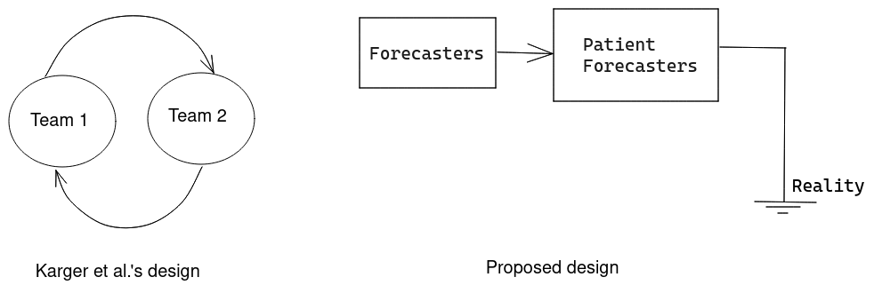

## Better scoring rules

This git repository outlines three scoring rules that I believe might serve current forecasting platforms better than current alternatives. The motivation behind it is my frustration with scoring rules as used in current forecasting platforms, like Metaculus, Good Judgment Open, Manifold Markets, INFER, and others. In [Sempere and Lawsen](https://arxiv.org/abs/2106.11248), we outlined and categorized how current scoring rules go wrong, and I think that the three new scoring rules I propose avoid the pitfalls outlined in that paper. In particular, these new incentive rules incentivize collaboration.

I was also frustrated with the "reciprocal scoring" method recently proposed in [Karger et al.](https://papers.ssrn.com/sol3/papers.cfm?abstract_id=3954498). It's a method that can be used to resolve questions which may otherwise seem unresolvable or resolve a long time from now. But it resembles a [Keynesian Beauty Contest](https://en.wikipedia.org/wiki/Keynesian_beauty_contest), which means that the forecasters are not incentivized to directly predict reality, but instead to predict the opinion which will be mainstream among forecasters. So I also propose two replacement scoring rules for reciprocal scoring.

I am choosing to publish these scoring rules in Github and in the [arxiv](https://www.arxiv.com/) [^arxiv] because journals tend to be extractive[^elsevier] and time consuming, and because I am in a position to not care about them. In any case, the three scoring rules are:

- [_Beat the house_](https://github.com/SamotsvetyForecasting/optimal-scoring/blob/master/1-beat-the-house/beat-the-house.pdf) outlines three small tweaks to the logarithmic scoring rule that makes it collaborative and suitable for distributing a fixed amount of reward.
- [_Amplified Oracle_](https://github.com/SamotsvetyForecasting/optimal-scoring/blob/master/2-amplified-oracle/amplified-oracle.pdf) provides what I believe to be a more elegant alternative to [Karger et al.'s reciprocal scoring](https://papers.ssrn.com/sol3/papers.cfm?abstract_id=3954498)
- [_Amplify a Bayesian_](https://github.com/SamotsvetyForecasting/optimal-scoring/blob/master/3-amplify-bayesian/amplify-bayesian.pdf) provides a more speculative alternative to Karger et al.'s reciprocal scoring rule.

Although _Amplified Oracle_ builds upon _Beat the house_ to ensure collaborativeness, I would recommend reading _Amplified Oracle_ first, and then coming back to _Beat the house_ if needed.

Issues (complaints or ideas) or pull requests (tweaks and improvements to our work) are both welcome. I would also like to thank Eli Lifland, Gavin Leech and Misha Yagudin for comments and suggestions, as well as Ezra Karger, SimonM, Jaime Sevilla and others for fruitful discussion.

[^arxiv]: I am planning to update these papers to the arxiv around the 30th of April, so discussion and suggestions before then might be particularly valuable
[^elsevier]: For instance, the open access option in the International Journal of Forecasting has an embargo period of [24 months (2 years)](https://www.elsevier.com/journals/international-journal-of-forecasting/0169-2070/open-access-options) or price of [$1,200](https://www.elsevier.com/books-and-journals/journal-pricing/apc-pricelist). I also think that the article publishing model is a bad fit, since the proposed scoring rules are fairly experimental.
