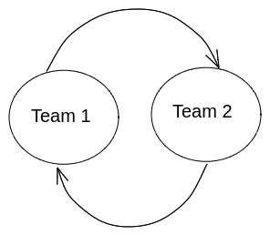

## Better scoring rules

This git repository outlines three scoring rules that I believe might serve current forecasting platforms better than current alternatives. It stems from my frustrations with current scoring rules, as outlined in [Sempere and Lawsen](https://arxiv.org/abs/2106.11248), and with the Keynesian Beauty Contest method used in [Karger et al.](https://papers.ssrn.com/sol3/papers.cfm?abstract_id=3954498) to resolve questions which may otherwise seem unresolvable.

I am choosing to publish them in git and in the [arxiv](https://www.arxiv.com/) because journals tend to be extractive and time consuming, and because I am in a position to not care about them. In any case, the three scoring rules are:

- [*Beat the house*](https://github.com/SamotsvetyForecasting/optimal-scoring/blob/master/1-beat-the-house/beat-the-house.pdf) outlines three small tweaks to the logarithmic scoring rule that makes it collaborative and suitable for distributing a fixed amount of reward. 
- [*Amplified Oracle*](https://github.com/SamotsvetyForecasting/optimal-scoring/blob/master/2-amplified-oracle/amplified-oracle.pdf) provides what I believe to be a more elegant alternative to [Karger et al.'s reciprocal scoring](https://papers.ssrn.com/sol3/papers.cfm?abstract_id=3954498)
- [*Amplify Rootclaim*](https://github.com/SamotsvetyForecasting/optimal-scoring/blob/master/3-amplify-rootclaim/amplify-rootclaim.pdf) provides a more speculative alternative to Karger et al.'s reciprocal scoring rule.

Although *Amplify Samotsvety* builds upon *Beat the house* to ensure collaborativeness, I would recommend reading *Amplify Samotsvety* first, and then come back to *Beat the house* if needed.

Issues (complaints or ideas) or pull requests (tweaks and improvements to our work) are both welcome.
